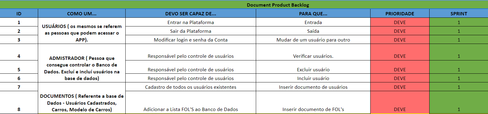

--------------------------------------------------------------------------------------------------------------------

<h1>TecStock📖🖥️ :</h1>

<h1 align="center">Welcome to the TecStock's Project!
 </h1> 

--------------------------------------------------------------------------------------------------------------------
## :microscope: THE PROJECT:: 

 Creating a mobile platform with the objective manage Files that informs the user
about his vehicle and actualizations about the documentations.

Align with the strategic objectives to be achived by each equipment 
that able to inform the client.

--------------------------------------------------------------------------------------------------------------------
##  :handshake: Team

[    @Anna Carolina ](https://github.com/AnnaCMendes)| [    @Cristian ](https://github.com/CristianMateusTB) | [    @Rafael Bettini  ](https://github.com/Rafael-BD) | [    @Natalia ](https://github.com/NataliaBiscaro)| [    @Rafael  ](https://github.com/Rafaeldossper) | [    @Guilherme  ](https://github.com/guilherme4garcia) 
 | :---: |:---:|:---:|:---:|:---:|:---:|

--------------------------------------------------------------------------------------------------------------------
##  🏬 Partners

                     ▶️  <a href="http://fatecsjc-prd.azurewebsites.net/">FATEC - São José dos Campos</a>.
              

              

                     ▶️  <a href="https://embraer.com/br/pt">EMBRAER</a>.
              

       
--------------------------------------------------------------------------------------------------------------------
<section id="Branches_assignments">
       <h2><i>Branches</i> for each assignment</h2>
       <table>
              <thead>
                     <th width=100px>Assigments</th>
                     <th>Descriptions</th>
                     <th width=215px>Date</th>
                     <th>Links</th>
              </thead>
              <tbody>
                     <tr>
                            <td>First Assignment</td>
                            <td>Screen prototypes, search FOL's, user's screen, login area</td>
                            <td>25/03 - 14/04</td>
                            <td><a href="">Sprint 1</td>
                     </tr>
                     <tr>
                            <td>Second Assignment</td>
                            <td> </td>
                            <td>25/04 - 15/05</td>
                            <td><a href="">Sprint 2</td>
                     </tr>
                     <tr>
                            <td>Third Assignment</td>
                            <td></td>
                            <td>16/05 - 05/06</td>
                            <td><a href="">Sprint 3</a></td>
                     </tr>

              </tbody>
        </table>
</section>

--------------------------------------------------------------------------------------------------------------------
## :hourglass_flowing_sand: **_System sprint cards:_**

<section id="cards" >  </img>
           <h4> First Assignment :clock12:</h4>
       
We carried out the screens project, so the client is able to visualize how is gonna be the visual part in the system.

We started the DataBase development, where the datas will be analysed to have actualized informations

To have a communication between the screens, we realized the building of some system routes 

## <h1 align="center">  </h1> 

--------------------------------------------------------------------------------------------------------------------

## :bookmark: **_Total Backlog_**

<h1><i>System </i><i> sprints</i> Backlog</h1>

<h4>First Assignment 📇</h4>
 <h1 align="center"> 

--------------------------------------------------------------------------------------------------------------------

## :bookmark: **_BURNDOWN_**

                     </img>
              

 

--------------------------------------------------------------------------------------------------------------------

